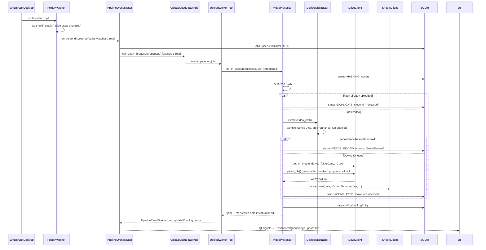

# Architecture

## Layering

InstaCore Sync follows a straightforward clean-architecture split: **domain**
(pure data), **services** (business logic, one package per concern),
**db** (persistence), **workers** (thread/asyncio bridging), and **ui**
(PySide6, presentation only). Every service receives its dependencies
through its constructor — there are no module-level singletons — which is
what makes the whole pipeline testable without Qt, without a real Google
account, and without Tesseract installed (see the test suite).

```
┌─────────────────────────────────────────────────────────────────────┐
│ ui/  (PySide6 — MainWindow, Dashboard/Queue/Logs/Settings views)      │
│   never imports asyncio or touches services directly — only reads    │
│   ViewModels and PipelineSignalBus (Qt signals)                       │
└───────────────▲─────────────────────────────────────────────────────┘
                 │ Qt signals (auto cross-thread queued connections)
┌───────────────┴─────────────────────────────────────────────────────┐
│ workers/  PipelineThread — owns a dedicated asyncio event loop        │
│   bridges PipelineEventSink (protocol) → PipelineSignalBus (Qt)       │
└───────────────▲─────────────────────────────────────────────────────┘
                 │ async
┌───────────────┴─────────────────────────────────────────────────────┐
│ services/pipeline/  PipelineOrchestrator                              │
│   watcher discovery → UploadQueue → UploadWorkerPool → VideoProcessor │
└──┬──────────┬──────────┬──────────┬──────────┬──────────┬───────────┘
   │          │          │          │          │          │
watcher/    video/      ocr/      hashing/   drive/     sheets/
FolderWatcher FrameExtractor DeviceIdExtractor HashService DriveClient SheetsClient
   │                          (Tesseract/PaddleOCR)         dedup/
   │                                                      DedupService
   └──────────────────────────┬───────────────────────────────┘
                               ▼
                      db/  Database (SQLite, WAL)
                      JobsRepository · LogsRepository · HashesRepository
                      SettingsRepository · DriveFolderCacheRepository
```

## Composition root

`app.py::InstacoreSyncApp` is the single place allowed to know about every
layer at once. It builds the `Database`, every repository, every service,
the `PipelineOrchestrator`, the `PipelineSignalBus`, and the `PipelineThread`,
registering each into a small `ServiceContainer` (`core/di.py`) — a typed
dict, not a magic framework — then `MainWindow` resolves what it needs from
that container. This keeps `app.py` the only file with "the whole graph" in
its head; everything downstream is unit-testable in isolation.

## Data flow: one video, start to finish



## Concurrency model

- **UI thread**: Qt event loop only. Never blocks on I/O.
- **PipelineThread**: one dedicated OS thread running its own `asyncio`
  event loop for the lifetime of the app. Owns the `FolderWatcher`'s worker
  thread indirectly (the watcher runs its own daemon threads and calls back
  into the asyncio loop via `call_soon_threadsafe`).
- **UploadWorkerPool**: N asyncio tasks (`= uploads.max_concurrent`, default
  12) each pulling from `UploadQueue` and offloading the *synchronous*
  `VideoProcessor.process()` call to a shared `ThreadPoolExecutor` via
  `run_in_executor`. This is what gives real 10-20-way concurrency for
  OpenCV/OCR/Drive-API work (all of which are blocking C-extension or
  `requests`-based calls that don't benefit from being `async def`
  themselves) without ever blocking the asyncio loop or the GUI.
- **Retries**: on a `FAILED` result, `UploadWorkerPool` re-queues the job
  with exponential backoff (`retry_backoff_seconds * 2^attempt`) up to
  `retry_count` attempts before giving up. `NEEDS_REVIEW`, `DUPLICATE`, and
  `COMPLETED` are terminal — never retried.
- **Qt signal bus**: `PipelineSignalBus` (a `QObject`) is called from
  worker/asyncio threads; because its signals are connected with Qt's
  default `AutoConnection`, PySide6 automatically marshals each emission
  onto the GUI thread as a queued event. No manual locking is needed
  anywhere in the UI layer.

## Why the pipeline core never imports Qt

`services/pipeline/events.py` defines `PipelineEventSink` as a `Protocol`
with a `NullEventSink` no-op default. `PipelineOrchestrator`,
`UploadWorkerPool`, and `VideoProcessor` depend only on that protocol, not
on `workers/signals.py`'s Qt implementation. That's what let the entire
integration test suite (`tests/integration/test_video_processor.py`) run
without a `QApplication`, and it's what would let a future CLI-only mode or
a different UI toolkit reuse the exact same pipeline unmodified.

## Resilience posture

Per the product requirement "never stop processing": every per-video
exception is caught inside `VideoProcessor.process()` and converted into a
terminal job status (`NEEDS_REVIEW` or `FAILED`) plus a logged error — it
never propagates up and kills a worker task. Startup-time failures (missing
Tesseract binary, missing/invalid Google credentials, an unreadable watch
folder) are reported as degraded status in the top bar rather than crashing
the app; the OCR-engine and Google-auth probes in
`PipelineOrchestrator.start()` are wrapped accordingly.
