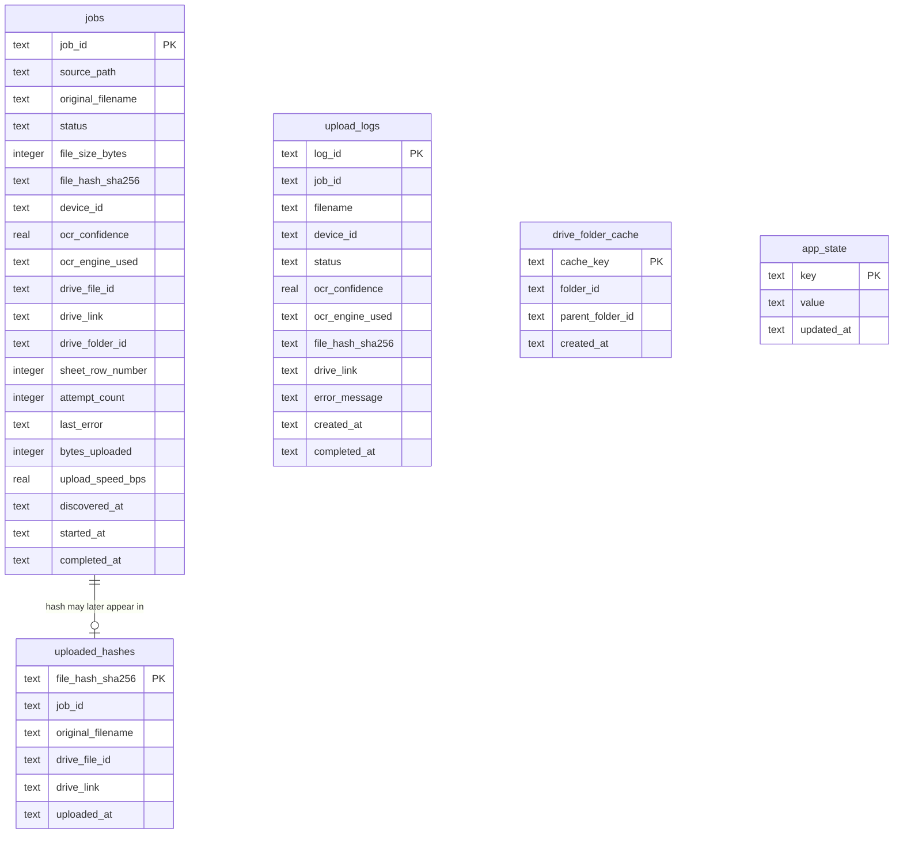

# Database Schema

InstaCore Sync uses a single local SQLite database (WAL journal mode) at
`%LOCALAPPDATA%\InstacoreSync\instacore_sync.db`. The schema is built up by
`src/instacore_sync/db/migrations/*.sql`, applied in order and automatically
on first connection by `Database.ensure_migrated()`
(`src/instacore_sync/db/database.py`) — there is no separate migration
command to run.

| Migration | Adds |
|---|---|
| `0001_init.sql` | The initial schema: `jobs`, `uploaded_hashes`, `upload_logs`, `drive_folder_cache`, `app_state` |
| `0002_needs_review_fields.sql` | `jobs.ocr_raw_text` and `jobs.manually_confirmed` — the Needs Review screen's detected-text display and manual-override tracking |
| `0003_log_timing_fields.sql` | `upload_logs.ocr_duration_seconds`, `.upload_duration_seconds`, `.total_duration_seconds`, `.stack_trace` — per-stage timing and full tracebacks for unexpected failures, surfaced in the Logs screen |

The tables/columns below reflect the schema after all three migrations.

## Entity-relationship overview

## Table purposes

### `jobs` — live working table
One row per video **currently known to the pipeline**, from the moment the
folder watcher sees it through to a terminal status (`completed`, `failed`,
`needs_review`, `duplicate`). `JobsRepository.upsert()` writes to this table
on every status transition, so the Dashboard/Queue views (which poll or
subscribe to `job_updated` events) always reflect current state. This table
is expected to be pruned periodically in a future maintenance job (old
`completed` rows aren't needed once mirrored to `upload_logs`) — that's why
`uploaded_hashes.job_id` intentionally has **no foreign key** to this table
(see below).

### `uploaded_hashes` — local dedup index (fast path, not the source of truth)
SHA-256 → the Drive file it was uploaded as. `HashesRepository`/`DedupService`
check this before every upload; a match short-circuits the pipeline straight
to `DUPLICATE` without re-uploading. `job_id`/`original_filename` here are
informational only, **not** a foreign key to `jobs` — this index must
survive independently of whatever retention policy the `jobs` working table
eventually gets, since "never upload the same video twice" is a permanent
guarantee, not one scoped to how long we keep job history.

This table is local to *this install* — when many independent installs
share one Drive destination, a video forwarded to several people is a
miss in every one of their local `uploaded_hashes` tables until one of
them finishes uploading it. `VideoProcessor._find_remote_duplicate()`
covers that gap on a local miss by asking Drive itself (via the `sha256`
custom property every upload is tagged with) and backfilling this table
from the result — see `docs/DEPLOYMENT_AT_SCALE.md`.

### `upload_logs` — durable, append-only audit trail
One row is appended by `VideoProcessor._finalize()` every time a job reaches
a terminal status — this is what the **Logs** screen searches, filters, and
exports to CSV (`LogsRepository.search()` / `.export_csv()`). Unlike `jobs`,
rows here are never updated or deleted by normal operation, making it safe
to point BI/reporting tools at it directly.

### `drive_folder_cache` — Drive API call reduction
Maps a cache key (`"31 Aug 2026"` for a date folder, `"31 Aug 2026/IC-188"`
for a device folder nested under it) to the resolved Drive folder ID, so
`DriveClient.get_or_create_date_folder()` /
`get_or_create_device_folder()` only call the Drive `files.list`/`files.create`
APIs once per folder per app lifetime rather than once per video (at
150-200 videos/day into a handful of IC folders, this avoids hundreds of
redundant list calls and materially reduces Drive API quota usage).

This cache is purely local to one install — it is never the source of
truth for *whether a folder exists*, only a shortcut to skip re-asking
Drive. When many independent installs share one Drive destination,
`DriveClient._find_or_create_folder()` still has to handle two processes
racing to create the same folder (Drive itself has no atomic
check-then-create); see its docstring and
[`docs/DEPLOYMENT_AT_SCALE.md`](DEPLOYMENT_AT_SCALE.md) for how that
reconciles.

### `app_state` — generic key/value store
A small escape hatch for state that doesn't belong in the YAML settings file
(user-editable config) but also isn't part of the job/log domain — e.g. a
future "last successful full sync" timestamp. Currently used sparingly;
prefer `config/settings.local.yaml` (via `AppSettings`) for anything a user
should be able to see/edit.

## Indexes

| Table | Index | Why |
|---|---|---|
| `jobs` | `idx_jobs_status` | Dashboard/Queue filter by status constantly (`list_by_status`, `list_active`, `counts_by_status`) |
| `jobs` | `idx_jobs_device_id` | Future "jump to this IC's recent uploads" lookups |
| `jobs` | `idx_jobs_discovered_at` | Ordering the queue oldest-first |
| `upload_logs` | `idx_logs_status`, `idx_logs_device_id`, `idx_logs_created_at`, `idx_logs_filename` | Every one of these is a `LogsRepository.search()` filter dimension |

## Concurrency notes

- **WAL journal mode** (`PRAGMA journal_mode = WAL`) lets the GUI thread
  read (Dashboard polling, Logs search) concurrently with worker threads
  writing job status transitions, without either blocking the other for
  normal-sized transactions.
- **Serialized writes**: `Database.write_cursor()` wraps every write in a
  process-wide `RLock` to avoid `SQLITE_BUSY` contention when many upload
  workers finish around the same time; `busy_timeout` is additionally set to
  30s as a second line of defense.
- **One connection per thread**: SQLite connections aren't safe to share
  across threads, so `Database.connection()` lazily opens one connection per
  calling thread (a `threading.local`), which is also why the schema
  migration step is idempotent and safe to trigger redundantly.

## Adding a future migration

Add `0002_your_change.sql` to `src/instacore_sync/db/migrations/`, ending
with `INSERT OR IGNORE INTO schema_migrations (version) VALUES (2);` (see
`0001_init.sql` for the pattern). `Database._run_migrations()` picks up any
`*.sql` file whose numeric prefix isn't already in `schema_migrations` and
applies it in order, once, inside a single transaction.
